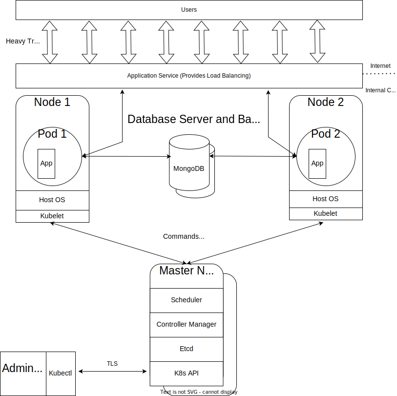

# Final Project Report

> Ahmed Nouralla - a.shaaban@innopolis.university
>
> Igor Mpore - i.mpore@innopolis.university

## Idea

Deploying a web application (**Express** + **MongoDB**) with **Kubernetes** on **Azure**, following security best practices recommended by [Azure](https://docs.microsoft.com/en-us/azure/aks/concepts-security) and [Kubernetes](https://kubernetes.io/docs/tasks/administer-cluster/securing-a-cluster/).

## Application

- The application being deployed is a sample application showing user info and allows updating them.

- Data is being stored and retrieved from MongoDB.

- To test the application locally, simply run `docker-compose build && docker-compose up`, then navigate to http://localhost:3000

## Architecture




## Deployment

- [Azure CLI](https://docs.microsoft.com/en-us/cli/azure/install-azure-cli) and [docker](https://docs.docker.com/get-docker/) are used.

  ```bash
  # Login to Azure cli
  $ az login
  
  # Create a resource group
  $ az group create --name myResourceGroup --location westeurope
  
  # Create container registry (to store app image)
  $ az acr create --resource-group myResourceGroup --name sh3b0cr --sku Basic
  
  # Login to container registry
  $ az acr login --name sh3b0cr
  
  # Get AcrLoginServer name
  $ az acr list --resource-group myResourceGroup --query "[].{acrLoginServer:loginServer}" --output table
  
  # Tag app image with AcrLoginServer
  $ docker tag emka_app:v1 sh3b0cr.azurecr.io/emka_app:v1
  
  # Push app image to registry
  $ docker push sh3b0cr.azurecr.io/emka_app:v1
  
  # Deploy app to Azure Kubernetes Service
  $ az aks create \
      --resource-group myResourceGroup \
      --name myAKSCluster \
      --node-count 2 \
      --generate-ssh-keys \
      --attach-acr sh3b0cr
      
  # Install kubectl
  $ az aks install-cli
  
  # Connect to AKS Cluster using kubectl 
  $ az aks get-credentials --resource-group myResourceGroup --name myAKSCluster
  
  # Show nodes
  $ kubectl get nodes
  
  NAME                                STATUS   ROLES   AGE     VERSION
  aks-nodepool1-15508900-vmss000000   Ready    agent   4m33s   v1.22.6
  aks-nodepool1-15508900-vmss000001   Ready    agent   4m56s   v1.22.6
  
  # Apply k8s deployment
  $ cd kubernetes
  $ kubectl apply -f mongo-config.yaml
  $ kubectl apply -f mongo-secret.yaml
  $ kubectl apply -f mongo.yaml
  $ kubectl apply -f webapp.yaml
  
  # Show status
  $ kubectl get all
  
  AME                                     READY   STATUS    RESTARTS   AGE
  pod/mongo-deployment-7875498c-6nkjt      1/1     Running   0          52m
  pod/webapp-deployment-5d9bd7f5b5-8q8dp   1/1     Running   0          52m
  pod/webapp-deployment-5d9bd7f5b5-k698x   1/1     Running   0          52m
  
  NAME                     TYPE           CLUSTER-IP     EXTERNAL-IP    PORT(S)        AGE
  service/kubernetes       ClusterIP      10.0.0.1       <none>         443/TCP        106m
  service/mongo-service    ClusterIP      10.0.246.166   <none>         27017/TCP      52m
  service/webapp-service   LoadBalancer   10.0.12.69     20.31.66.224   80:30100/TCP   52m
  
  NAME                                READY   UP-TO-DATE   AVAILABLE   AGE
  deployment.apps/mongo-deployment    1/1     1            1           52m
  deployment.apps/webapp-deployment   2/2     2            2           52m
  
  NAME                                           DESIRED   CURRENT   READY   AGE
  replicaset.apps/mongo-deployment-7875498c      1         1         1       52m
  replicaset.apps/webapp-deployment-5d9bd7f5b5   2         2         2       52m
  
  ```

- Application was successfully deployed and is available at http://20.31.66.224


## Security Considerations

Almost all security aspects are managed by the cloud provider, here we demonstrate our understanding of the security measures taken.

### Application and Image Security

- When installing application dependencies with `npm install`, we made sure that no vulnerabilities were found in the used versions of the dependencies.
- Docker also provides `docker scan` addon which we can configure to run periodically to scan the image against vulnerability databases such as Snyk and alert on found issues.
- Database credentials are implemented using K8s secrets which are stored in `etcd`, the cloud provider ensures [encryption at rest](https://docs.microsoft.com/en-us/azure/aks/concepts-security#:~:text=Etcd%20store%20is%20fully%20managed%20by%20AKS%20and%20data%20is%20encrypted%20at%20rest%20within%20the%20Azure%20platform.) with a platform-managed key.
- // https

### Registry Security

- Application image is deployed to Azure Container Registry with RBAC configured to only allow the K8s cluster to pull the image.

### Cluster Security

#### Worker nodes security

- As demonstrated above, **worker nodes use a private IP address range** that is not publicly accessible from the Internet. This ensures that individual nodes are not vulnerable to any remote attacks. The physical security of the nodes is ensured by the cloud provider.

#### Master server security

- **Public master API:** when creating the cluster we can use `--api-server-authorized-ip-ranges`  to restrict the range of IP address authorized to access the API.
- **Private master API:** a more secure [setup](https://docs.microsoft.com/en-us/azure/aks/private-clusters) would be to have a private master API; Communication with the API can then be done by establishing a VPN Tunnel, or using  `az aks command invoke` which allows invoking commands like `kubectl` remotely through Azure API without directly connecting to the cluster.

### OS security for nodes

- Worker nodes are running Linux servers with the latest security updates and patches.
- It’s the responsibility of the cloud provider to schedule nightly updates of the worker nodes with minimal disruption to the service.

### Network Security

- The private subnet where nodes are deployed should be isolated from any other subnets through firewalls, this is also the responsibility of the cloud provider.

### Auditing, Logging, and monitoring

- 


## Tasks

- Test deployment -> Production deployment
  - HTTPS with domain name
  - Nginx Ingress controller

- Improve diagram
  - DB is a node
  - Ingress controller (nginx)

- Presentation
  - Architecture slide
  - Risks vs Mitigation slide
- Prometheus

